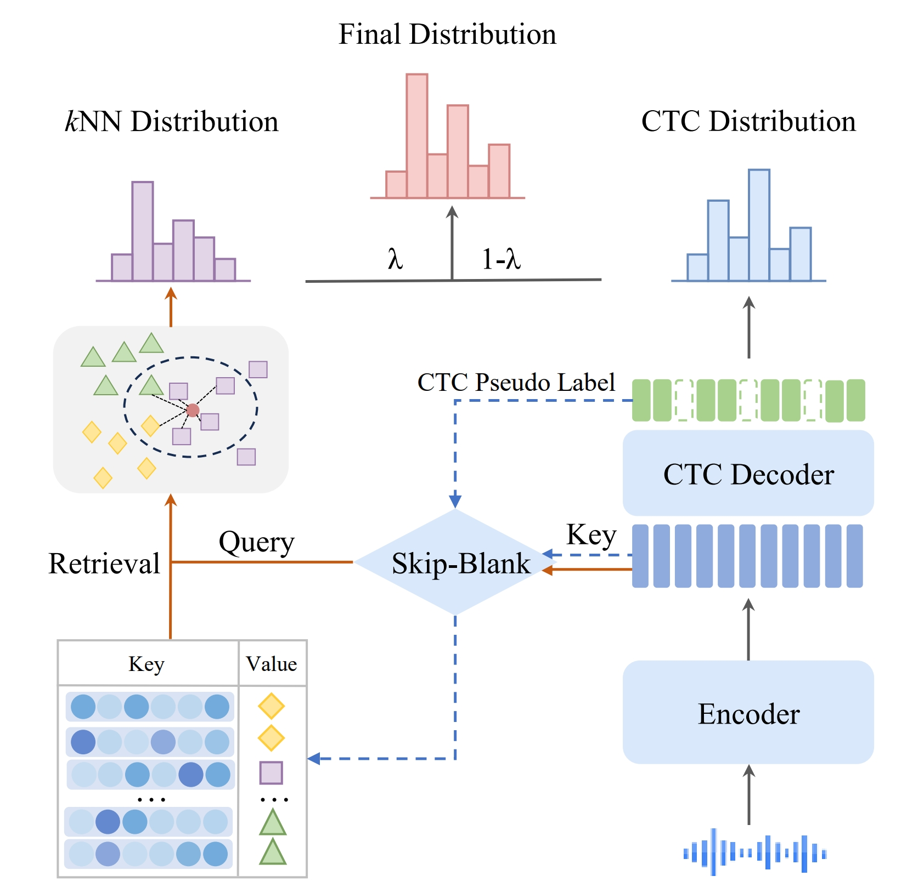

👋 KNN-CTC: ENHANCING ASR VIA RETRIEVAL OF CTC PSEUDO LABELS


**Jiaming Zhou**; Shiwan Zhao; Yaqi Liu; Wenjia Zeng; Yong Chen; Yong Qin

## Overview

The success of retrieval-augmented language models in various natural language processing (NLP) tasks has been constrained in automatic speech recognition (ASR) applications due to challenges in constructing fine-grained audio-text datastores. This paper presents $k$NN-CTC, a novel approach that overcomes these challenges by leveraging Connectionist Temporal Classification (CTC) pseudo labels to establish frame-level audio-text key-value pairs, circumventing the need for precise ground truth alignments. We further introduce a \emph{``skip-blank''}  strategy, which strategically ignores CTC \emph{blank} frames, to reduce datastore size. $k$NN-CTC incorporates a $k$-nearest neighbors retrieval mechanism into pre-trained CTC ASR systems, achieving significant improvements in performance. 
By incorporating a $k$-nearest neighbors retrieval mechanism into pre-trained CTC ASR systems and leveraging a fine-grained, pruned datastore, $k$NN-CTC consistently achieves substantial improvements in performance under various experimental settings.




- 👉 The full version of this paper is at https://ieeexplore.ieee.org/document/10447075
- 👉 The code is available at https://github.com/NKU-HLT/KNN-CTC
- 💬 Welcome to contact me, my email is <zhoujiaming@mail.nankai.edu.cn>
- 📚 Cite me
```
@INPROCEEDINGS{10447075,
  author={Zhou, Jiaming and Zhao, Shiwan and Liu, Yaqi and Zeng, Wenjia and Chen, Yong and Qin, Yong},
  booktitle={ICASSP 2024 - 2024 IEEE International Conference on Acoustics, Speech and Signal Processing (ICASSP)}, 
  title={KNN-CTC: Enhancing ASR via Retrieval of CTC Pseudo Labels}, 
  year={2024},
  volume={},
  number={},
  pages={11006-11010},
  keywords={Codes;Signal processing;Natural language processing;Acoustics;Speech processing;Task analysis;Automatic speech recognition;speech recognition;CTC;retrieval-augmented method;datastore construction},
  doi={10.1109/ICASSP48485.2024.10447075}}
```


