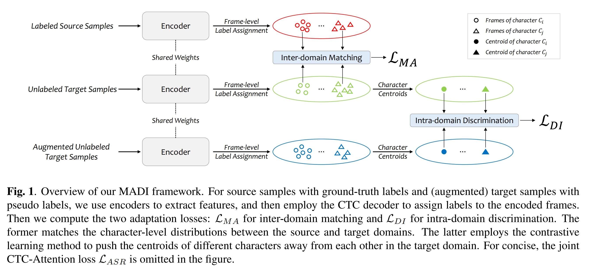

👋 MADI: Inter-Domain Matching and Intra-Domain Discrimination for Cross-Domain Speech Recognition

**Jiaming Zhou**; Shiwan Zhao; Ning Jiang; Guoqing Zhao; Yong Qin

## Overview

End-to-end automatic speech recognition (ASR) usually suffers from performance degradation when applied to a new domain due to domain shift. Unsupervised domain adaptation (UDA) aims to improve the performance on the unlabeled target domain by transferring knowledge from the source to the target domain. To improve transferability, existing UDA approaches mainly focus on matching the distributions of the source and target domains globally and/or locally, while ignoring the model discriminability. In this paper, we propose a novel UDA approach for ASR via inter-domain MAtching and intra-domain DIscrimination (MADI), which improves the model transferability by fine-grained inter-domain matching and discriminability by intra-domain contrastive discrimination simultaneously. Evaluations on the Libri-Adapt dataset demonstrate the effectiveness of our approach. MADI reduces the relative word error rate (WER) on cross-device and cross-environment ASR by 17.7% and 22.8%, respectively.



- 👉  You can find the full version of this paper in https://ieeexplore.ieee.org/abstract/document/10095177
- 💬 Welcome to contact me, my email is <zhoujiaming@mail.nankai.edu.cn>
- 📚 Cite me
```
@INPROCEEDINGS{10095177,
  author={Zhou, Jiaming and Zhao, Shiwan and Jiang, Ning and Zhao, Guoqing and Qin, Yong},
  booktitle={ICASSP 2023 - 2023 IEEE International Conference on Acoustics, Speech and Signal Processing (ICASSP)}, 
  title={MADI: Inter-Domain Matching and Intra-Domain Discrimination for Cross-Domain Speech Recognition}, 
  year={2023},
  volume={},
  number={},
  pages={1-5},
  doi={10.1109/ICASSP49357.2023.10095177}}
```


